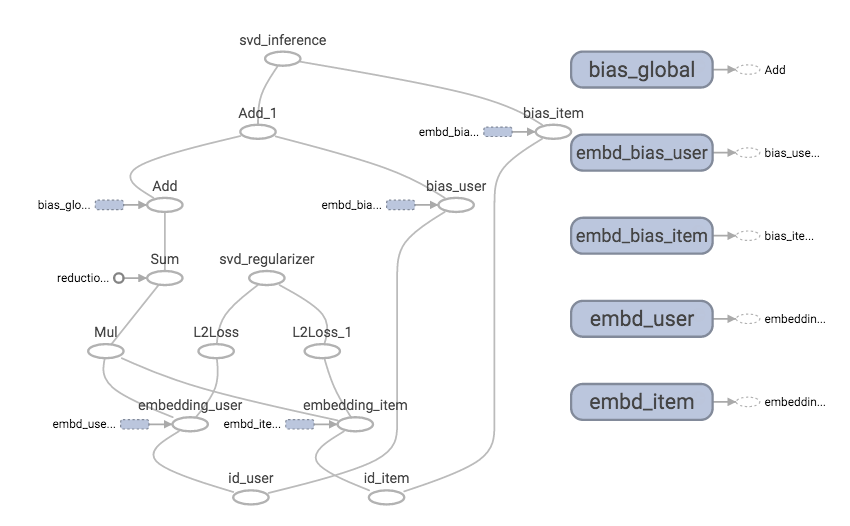

# TF-recomm
### Tensorflow-based Recommendation systems

Factorization models are very popular in recommendation systems because they can be used to discover latent features underlying the interactions between two different kinds of entities. There are many variations of factorization algorithms (SVD, SVD++, factorization machine, ...). When implementing them or developing new ones, you probably spend a lot of time on the following areas rather than modeling:
* Derivative calculation
* Variant SGD algorithm exploration
* Multi-thread acceleration
* Vectorization acceleration

[Tensorflow](https://www.tensorflow.org/) is a general computation framework using data flow graphs although deep learning is the most important application of it. With Tensorflow, derivative calculation can be done by auto differentiation, which means that you only need to write the inference part. It provides variant fancy SGD learning algorithms, CPU/GPU acceleration, and distributed training in a computer cluster. Since Tensorflow has some embedding modules for word2vc-like application, it is supposed to be a good platform for factorization models as well, even in production. Please note that embedding in deep learning is equivalent to factorization in shallow learning! 

### Requirements
* Tensorflow >= r0.12 (Since Tensorflow is changing high-level APIs frequently, please check its version if errors happen.)
* Numpy
* Pandas

### Data set
[MovieLens](http://grouplens.org/datasets/movielens/) 1M data set is used. It looks as follows. The columns are user ID, item ID, rating, and timestamp
```
1::1193::5::978300760
1::661::3::978302109
1::914::3::978301968
1::3408::4::978300275
1::2355::5::978824291
```
The problem is to predict the rating given by user u and item i. The metric is typically RMSE between the true ratings and predictions.

### SVD implementation

#### Graph
Given by user u and item i, the inference of the classic SVD is 
```
y_pred[u, i] = global__bias + bias_user[u] + bias_item_[i] + <embedding_user[u], embedding_item[i]>
```
The objective is to minimize
```
\sum_{u, i} |y_pred[u, i] - y_true[u, i]|^2 + \lambda(|embedding_user[u]|^2 + |embedding_item[i]|^2)
```
The above can be directly written by Tensorflow DSL as the [operations](https://github.com/songgc/TF-recomm/blob/master/ops.py). The Adam algorithm is used for the optimizer. The TF graph would be like


#### Run
```bash
./download_data.sh
python svd_train_val.py
```
The results would be as follows. The validation RMSE is around or below 0.850.
```
epoch train_error val_error elapsed_time
  0 2.637530 2.587753 0.129696(s)
  1 1.034569 0.908686 4.110165(s)
  2 0.859582 0.887105 4.137014(s)
  3 0.835467 0.878246 4.132146(s)
  ...
 97 0.742144 0.849553 4.114120(s)
 98 0.742159 0.849624 4.120170(s)
 99 0.742281 0.849537 4.133140(s)
```

#### Speed tuning
To enable GPU for math operations, just set DEVICE="/gpu:0". The computation time of one epoch reduced from 4.1 to 3.4s.

Changing the batch size from 1000 to 10000. One epoch only requires 1.1s.

If you have large data, it is better to use TF [data pipeline](https://www.tensorflow.org/versions/r0.8/how_tos/reading_data/index.html).

### Others:
SVD++ will be provided soon.

### Reference
[Factorization Meets the Neighborhood: a Multifaceted Collaborative Filtering Model](http://www.cs.rochester.edu/twiki/pub/Main/HarpSeminar/Factorization_Meets_the_Neighborhood-_a_Multifaceted_Collaborative_Filtering_Model.pdf)
